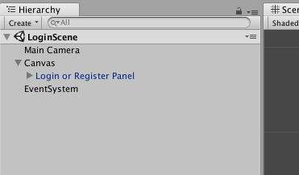
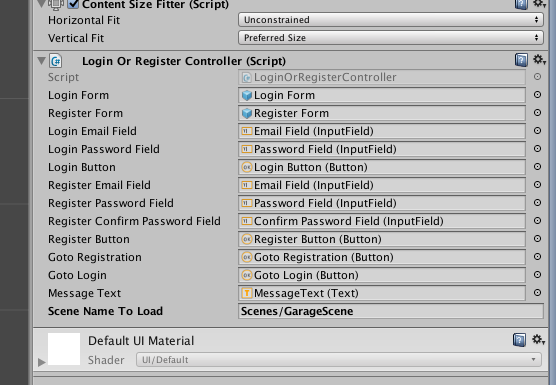

> **Warning:** Authentication is still in development and not officially supported yet. This documentation page might be outdated.


# Authentication

- [Quickstart with prefab](#quickstart-with-prefab)
- [Manual authentication](#manual-authentication)
    - [Registration](#registration)
    - [Login](#login)
    - [Logout](#logout)
    - [Getting state](#getting-state)
- [Registration hooks](#registration-hooks)


Player authentication is important, because only logged in players can communicate with the backend server.


<a name="quickstart-with-prefab"></a>
## Quickstart with prefab

Quickest way to get started is to use the registration and login form, that comes with Unisave asset. This prefab is located at `Unisave/Components/Auth/Login or Register Panel.prefab`.

Simply create a new scene called `LoginScene`, add a UI canvas into it and drag the prefab into the canvas.



Now you just tell the panel, what scene it should go to after a player logs in.

Select the `Login or Register Panel` and scroll down the `Inspector` window. You should see a `Login Or Register Controller`. This controller has a field named `Scene Name To Load`. Here you put the path to the next scene:



This prefab can be customized however you want, but if you need even more control, you can go deeper:


<a name="manual-authentication"></a>
## Manual authentication


<a name="registration"></a>
### Registration

You can register a new player by calling `Auth.Register(...)`:

```cs
using Unisave;
using Unisave.Exceptions.PlayerRegistration;

var hookArguments = new Dictionary<string, object>() {
    ["foo"] = "bar"
};

Auth.Register("email", "password", hookArguments)
    .Then(() => {
        // player has been registered, you can perform login now
    })
    .Catch(exception => {
        if (exception is EmailAlreadyRegisteredException)
            Debug.Log("Email already registered.");
    });
```

You simply provide an email address and a password. Third parameter is optional and it contains parameters for registration hooks (see section on hooks below).

On failure, just check what type the thrown exception is. Here is a quick overview:

- `Unisave.Exceptions.PlayerRegistration.`
    - `EmailAlreadyRegisteredException`
    - `InvalidEmailException`
    - `InvalidPasswordException`


<a name="login"></a>
### Login

Login is performed by the `Auth.Login(...)` method:

```cs
using Unisave;
using Unisave.Authentication;

Auth.Login("email", "password")
    .Then(() => {
        // login successful, load next scene
        SceneManager.LoadSceneAsync("HomeScene");
    })
    .Catch(exception => {
        LoginFailure failure = (LoginFailure)exception;
        
        if (failure.type == LoginFailureType.InvalidCredentials)
            Debug.Log("Wrong credentials");
        else
            Debug.Log(failure.message);
    });
```

When login fails, it always throws an exeception of type `Unisave.Authentication.LoginFailure`.

> **Note:** Login failure behaves differently compared to registration, because it uses an older approach.


<a name="logout"></a>
### Logout

Logging out is simple:

```cs
Auth.Logout();
```


<a name="getting-state"></a>
### Getting state

You can get the currently logged in player:

```cs
UnisavePlayer player = Auth.Player;
```

It will return `null` if no player is logged in.

To get just a boolean value about the logged in state, use `Auth.LoggedIn`:

```cs
if (Auth.LoggedIn)
    Debug.Log("Yes")
else
    Debug.Log("No")
```


<a name="registration-hooks"></a>
## Registration hooks

Registration hooks are a way to perform some action when a new player is registered.

To create a hook, go into the `Backend` folder, right click and choose `Create > Unisave > Hook > OnPlayerRegistration` and name it `MyHook`. It will create the following file:

```cs
using System.Collections;
using System.Collections.Generic;
using Unisave;

public class MyHook : PlayerRegistrationHook
{
    /// <summary>
    /// Execution order against other registration hooks
    /// </summary>
    public override int Order => 1;

    /// <summary>
    /// This method gets executed during registration of new players
    /// </summary>
    public override void Run()
    {
        /*
            Customize method implementation to your needs.
            Don't forget to provide all necessary arguments during registration.
         */

        // get an argument
        string myArgument = GetArgument<string>("myArgument");

        // reject registration on problems
        if (myArgument == null)
            Reject("My argument wasn't provided.");

        // create / modify entities
        // ...
    }
}
```

The `Run` method will be executed during registration of new players.

You can pass arguments into hooks, by specifying the last parameter of the `Auth.Register(...)` method. It accepts a `Dictionary<string, object>` value.

Then inside the hooks, you can access those values by name, using the `GetArgument<T>(string name)` method. Make sure the type `T` here matches the type you gave to the registration method.

The registration can be rejected by calling the `Reject(string message)` method. Calling this method will throw a `Unsiave.Exceptions.PlayerRegistration.PlayerRegistrationException` that will be given to the `.Catch(...)` block of the `Auth.Register` call.
