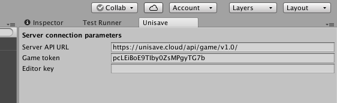

Cloud connection
================

> This manual describes, how to setup the connection between Unity engine and the cloud service.

First you need to create an account at [https://unisave.cloud/](https://unisave.cloud/)

Then inside the web app you create new game by clicking the button.

When you open the game dashboard you should see a field named `Game token`. This value identifies your game, whenever it makes requests to the cloud service. Your game needs to know this value.

Copy this value to clipboard and open your Unity project (with the Unisave asset imported). Now in Unity go to `Window > Unisave`. That opens Unisave configuration panel. On this panel you can see a field named `Game token`. Here you paste the value.

This is all you need to do, you can continue developing your awesome game.
