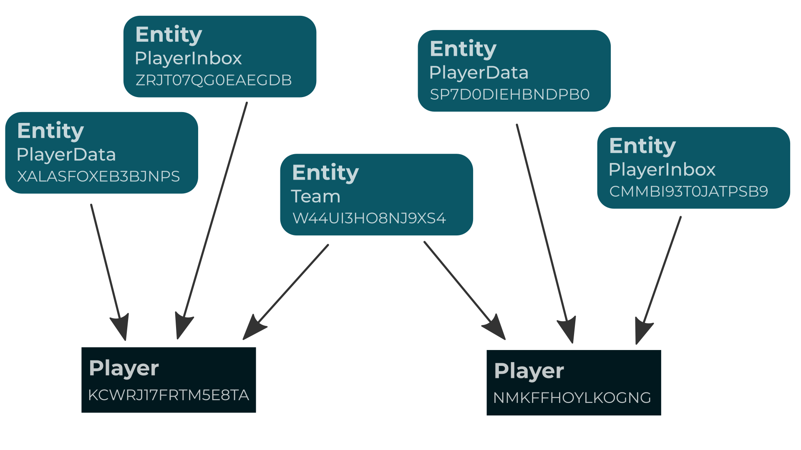

# Entities

- [Introduction](#introduction)
- [Declaration](#declaration)
- [Working with an entity](#working-with-an-entity)
    - [Create](#create)
    - [Update](#update)
    - [Delete](#delete)
    - [Refresh](#refresh)
    - [Entity IDs](#entity-ids)
    - [Find by ID](#find-by-id)
    - [Timestamps](#timestamps)
- [Entities belong to players](#entities-belong-to-players)
    - [Add owner](#add-owner)
    - [Remove owner](#remove-owner)
    - [Partial ownership knowledge](#partial-ownership-knowledge)
    - [Owner testing](#owner-testing)
    - [Owner enumeration](#owner-enumeration)
- [Entity queries](#entity-queries)
    - [Retrieving all entities of given type](#retrieving-all-entities-of-given-type)
    - [Retrieving the first entity](#retrieving-the-first-entity)
    - [Querying by owners](#querying-by-owners)
    - [Where clauses](#where-clauses)
    - [More complex filtering](#more-complex-filtering)
- [Singleton entities](#singleton-entities)
- [Transactions](#transactions)
    - [Manual transactions](#manual-transactions)
- [Locks](#locks)
    - [Lock for update](#lock-for-update)
    - [Shared lock](#shared-lock)
    - [Deadlocks](#deadlocks)


<a name="introduction"></a>
## Introduction

Unisave database holds only two kinds of objects: players and entities. Players obviously represent players of your game and are represented by the `UnisavePlayer` class. Entities on the other hand can represent anything you want.

Entity is basically just a fancy C# class, that has the ability to be saved and then later retrieved.

Entity has also the option of belonging to some players, which allows it to be easily queried.


<a name="declaration"></a>
## Declaration

Inside your `Backend/Entities` folder right click and choose `Create > Unsiave > Entity`. Type in the entity name `PlayerEntity`. A file with the following content will be created:

```cs
using System;
using System.Collections;
using System.Collections.Generic;
using Unisave;

public class PlayerEntity : Entity
{
    /// <summary>
    /// Replace this with your own entity attributes
    /// </summary>
    [X] public string MyAttribute { get; set; } = "Default value";
}
```

This file is a specification of a new entity type. You specify an attribute by creating a public property and adding the `[X]` marking to it. This marking is important since it tells Unisave to preserve this exact property. Without this mark, it would be just a regular C# property.

An entity is also just another class, so you can add fields and methods as you like.

So an entity that holds data about a player might look like this:

```cs
using System;
using System.Collections;
using System.Collections.Generic;
using Unisave;

public class PlayerEntity : Entity
{
    /// <summary>
    /// Player name displayed to other players
    /// </summary>
    [X] public string Name { get; set; }

    /// <summary>
    /// Number of coins owned
    /// </summary>
    [X] public int Coins { get; set; }

    /// <summary>
    /// When will the premium account expire (or has expired)
    /// </summary>
    [X] public DateTime PremiumUntil { get; set; } = DateTime.UtcNow;
}
```


<a name="working-with-an-entity"></a>
## Working with an entity


<a name="create"></a>
### Create

To create a new entity, simply create new instance and save it into the database:

```cs
var playerEntity = new PlayerEntity {
    Name = "John",
    Coins = 200
};

playerEntity.Save();
```

> **Warning:** `Save()` method might only be called from server code.


<a name="update"></a>
### Update

To modify any entity, you just set the corresponding attributes and save:

```cs
playerEntity.PremiumUntil = DateTime.UtcNow.AddDays(30);

playerEntity.Save();
```


<a name="delete"></a>
### Delete

An entity can be deleted from the database by calling `Delete` on it:

```cs
someEntity.Delete();
```

The method returns `true`, if the entity has been actually deleted and `false` if it wasn't in the database to begin with (someone might have deleted it before us).

> **Warning:** Make sure you don't use the entity instance after you call `Delete`. Unisave does not guarantee corectness of the instance state. Simply throw it away.


<a name="refresh"></a>
### Refresh

To pull the latest entity data from the database, use the `Refresh()` method:

```cs
playerEntity.Name = "Steve";

playerEntity.Refresh();

playerEntity.Name; // "John"
```


<a name="entity-ids"></a>
### Entity IDs

Each entity instance that is saved in the database has a unique string identifier. You can obtain this identifier as follows:

```cs
string id = playerEntity.EntityId;
```

If the entity has been created and not yet saved, it is not present in the database, so the `EntityId` will be `null`.


<a name="find-by-id"></a>
### Find by ID

When we have an ID of an entity, we can find it in the database:

```cs
var playerEntity = GetEntity<PlayerEntity>.Find(id);
```

If entity with given ID does not exist, `null` will be returned.


<a name="timestamps"></a>
### Timestamps

An entity also automatically keeps track of two timestamps: `CreatedAt` and `UpdatedAt`.

```cs
DateTime createdAt = someEntity.CreatedAt;
DateTime updatedAt = someEntity.UpdatedAt;
```

`CreatedAt` is set when `Save` is called for the first time.

`UpdatedAt` is set each time you call the `Save` method.

Both values are set to immediate `DateTime.UtcNow`.

> **Note:** When the entity is not yet stored in the database, timestamps have no meaningful value.

> **Note:** It's recommended that you use UTC time throughout Unisave and then convert to local time only on the client-side when displaying time to the player. This is because your game is most likely to be distributed around the world into multiple timezones, so you need to keep the values consistent.


<a name="entities-belong-to-players"></a>
## Entities belong to players

An entity can have a set of owners (players), that makes it much easier to access the entity.

For example the `PlayerEntity` from above logically belongs to a single player. We want to capture that fact and use it later on to query the entity.

You might have entities without any owners. Those are called *game entities* and the example would be a `MatchmakerEntity` holding list of waiting players or a `LeaderboardEntity`.

An entity can belong to a single player (called *player entities*), e.g. the `PlayerEntity` holding general data about a player or `MotorbikeEntity` that describes a motorbike the player might own.

There might also be entities belonging to multiple players (called *shared entities*), like `TeamEntity` representing a team of players or `MatchEntity` representing a single match (game / battle / race).

Summary of this idea is captured in the diagram below:




<a name="add-owner"></a>
### Add owner

Owners are managed through the `Owners` property on an entity.

To add new owner, just call `Owners.Add(player)` and save the entity:

```cs
using System.Collections;
using System.Collections.Generic;
using Unisave;

public class InitializeFreshPlayer : PlayerRegistrationHook
{
    /// <summary>
    /// Execution order against other registration hooks
    /// </summary>
    public override int Order => 1;

    /// <summary>
    /// This method gets executed during registration of new players
    /// </summary>
    public override void Run()
    {
        var playerEntity = new PlayerEntity();

        playerEntity.Owners.Add(this.Player);

        playerEntity.Save();
    }
}
```

If the player is already present, nothing happens.


<a name="remove-owner"></a>
### Remove owner

Removing a player is almost the same as addition:

```cs
someEntity.Owners.Remove(player);

someEntity.Save();
```


<a name="partial-ownership-knowledge"></a>
### Partial ownership knowledge

Since an entity might have a lot of owners (think a large player guild or alliance), not all owners are pulled from the database when an entity is pulled. This poses no problems when adding or removing owners, but it does when you test or query owners of an entity.

Server-side code has the advantage of having the database nearby, so it can run a query silently so you don't really need to worry about this. Client-side however needs to be aware of this problem.

Completeness of information indicates the `IsComplete` property:

```cs
if (someEntity.Owners.IsComplete)
{
    someEntity.Owner.Count;

    someEntity.Owner.Contains(player);

    foreach (UnisavePlayer owner in someEntity.Owner)
    {
        //
    }
}
```

> **Note:** When an entity is pulled from database, at least one owner will be pulled, but it is not guaranteed, so you shouldn't rely on it.

> **Todo:** Add a method to pull all owners to complete the information.


<a name="owner-testing"></a>
### Owner testing

You can test whether a player is an owner of a given entity:

```cs
someEntity.Owners.Contains(player); // true | false
```

Since the ownership may not be known, this method will query the database when needed. If such situation happens on the client side, `InvalidOperationException` will be thrown.

If you want to prevent the exception or database access, you can just try to get the result:

```cs
bool? contains = someEntity.Owners.TryContains(player); // may be null
```


<a name="owner-enumeration"></a>
### Owner enumeration

When you want to go through all the owners, just use a foreach loop:

```cs
foreach (UnisavePlayer owner in someEntity.Owners)
{
    //
}
```

This however is missing proper implementation and it throws `InvalidOperationException` even if the data could be pulled from the database.

> **Todo:** Try to pull owners when enumerating and the information is not complete.


<a name="entity-queries"></a>
## Entity queries

Entities can be queried from the database by the server-side code using the `GetEntity<T>` facade.

Understand, that this can not be done on the client-side, because the database is not accessible there.


<a name="retrieving-all-entities-of-given-type"></a>
### Retrieving all entities of given type

The simplest query is to get all entities of a given type:

```cs
List<MotorbikeConfigEntity> entities = GetEntity<MotorbikeConfigEntity>.Get();
```

> **Note:** This query will match *game entities* only. Meaning they have no owners.


<a name="retrieving-the-first-entity"></a>
### Retrieving the first entity

Sometimes we know, that there's going to be at most one instance of some entity in the database. In that case it's easier to ask for only that one entity, rather then a list:

```cs
MatchmakerEntity matchmakerEntity = GetEntity<MatchmakerEntity>.First();
```

If no such entity exists, `null` will be returned.

> **Note:** This query will match *game entities* only. Meaning they have no owners.

> **Warning:** Make sure you don't use the `First` method when you suspect that multiple entities might match the query, because the entity that will be chosen is picked at random.


<a name="querying-by-owners"></a>
### Querying by owners

Primary reason, why entity owners exist is to make querying much simpler and faster.

To query a *player entity* belonging to a specific player, use the `OfPlayer` method:

```cs
using System;
using System.Collections;
using System.Collections.Generic;
using Unisave;

public class PlayerFacet : Facet
{
    /// <summary>
    /// Returns information about the logged-in player
    /// </summary>
    public PlayerEntity GetPlayerEntity()
    {
        return GetEntity<PlayerEntity>
            .OfPlayer(this.Caller)
            .First();
    }
}
```

Each query by default matches the provided set of owners exactly. This means, that when you don't specify any owners, only *game entities* will be matched.

In the same manner, when you specify a single owner using the `OfPlayer` method, only *player entities* will be matched.

When you want to query *shared entities* however, you typically want entities with additional owners as well. This can be specified by calling the `AndOthers` method:

```cs
var playerTeam = GetEntity<TeamEntity>
    .OfPlayer(Caller)
    .AndOthers()
    .First();
```

When you want to query an entity and you don't care at all about the owners, you can use the `OfAnyPlayers` method. It has the same effect as `AndOthers`, but is easier to read:

```cs
var allMatches = GetEntity<MatchEntity>
    .OfAnyPlayers()
    .Get();
```

When you require two owners, you just chain the calls:

```cs
var match = GetEntity<MatchEntity>
    .OfPlayer(first)
    .OfPlayer(second)
    .First();
```

Or with many more, you can provide an enumerable to plural version of this method, which has the same effect:

```cs
var match = GetEntity<MatchEntity>
    .OfPlayers(listOfPlayers)
    .First();
```

> **Warning:** I'm using `First` in the example, but remember, that two players might have had multiple matches fought against each other. So really you should obtain all of them and get the latest one.


<a name="where-clauses"></a>
### Where clauses

When you filter entities by owners, you can further filter by values of their attributes. Keep in mind, however, that this kind of filtering is significantly slower than filtering by owners.

Say we want to get all players with premium accounts:

```cs
var premiumPlayers = GetEntity<PlayerEntity>
    .OfAnyPlayers()
    .Where("PremiumUntil", ">", DateTime.UtcNow)
    .Get();
```

Where clause consist of three parts:

- **attribute path** - a path to the attribute to be tested. Valid paths would be: `"foo"`, `"foo.bar"`, `"foo[4].bar[0]"`, `"foo[\"bar\"]"`. Paths correspond to paths through the serialized JSON representation of the entity.
- **operator** - one of the following operators: `=`, `<`, `>`, `<=`, `>=`, `<>`, `!=`. Equality operator can be omitted: `.Where("foo", 5)`
- **constant value** - any value that should be used for the other side of the operator.

When registering new player, you might want to check, that a given name is not used by anyone else:

```cs
using System.Collections;
using System.Collections.Generic;
using Unisave;

public class VerifyNameUniqueness : PlayerRegistrationHook
{
    /// <summary>
    /// Execution order against other registration hooks
    /// </summary>
    public override int Order => 1;

    /// <summary>
    /// This method gets executed during registration of new players
    /// </summary>
    public override void Run()
    {
        string providedName = GetArgument<string>("name");

        var existingPlayer = GetEntity<PlayerEntity>
            .OfAnyPlayers()
            .Where("Name", providedName)
            .First();

        if (existingPlayer != null)
            Reject("Name is already taken.");
    }
}
```

Applying multiple where clauses means that all have to be satisfied in order for an entity to be matched:

```cs
var wealthyPremiumPlayers = GetEntity<PlayerEntity>
    .OfAnyPlayers()
    .Where("Coins", ">", 20_000)
    .Where("PremiumUntil", ">", DateTime.UtcNow)
    .Get();
```

You can put clauses into disjunction by using the `OrWhere` method:

```cs
var nonAveragePlayers = GetEntity<PlayerEntity>
    .OfAnyPlayers()
    .Where("Coins", "<", 500)
    .OrWhere("Coins", ">", 10_000)
    .Get();
```

> **Todo:** Extend where clauses to timestamps (currently manual filtering is the only option).

> **Todo:** Write tests for datetime comparisons (should work, but add it to the test suite).


<a name="more-complex-filtering"></a>
### More complex filtering

You want to make a filter, that cannot be expressed with provided *where* clauses. Then you have no other option, but to do the filtering manually in memory:

```cs
using System.Linq;

var crazyFiltered = GetEntity<SomeEntity>
    .OfAnyPlayers()
    .Where("foo", "bar") // efficient pre-filtering in the database
    .GetEnumerable() // like Get(), but better
    .Where(e => e.EntityId.Contains("omg")) // linq filter in memory
    .ToList();
```

When doing such things, you have to consider how many entities will actually be pulled from the database. If you pull all player entities, you make the query not only super slow, but you risk running out of memory when your player count goes up.

Also note that you can replace `Get()` with `GetEnumerable()`. This does not cause constant memory usage however. It just offloads the buffering to Unisave, which can handle it in more careful way, but the memory problems might arise just as well.

Working with the data post-query can be also used to sort the results, since ordering is not yet supported.

> **Todo:** Add result ordering into queries.


<a name="singleton-entities"></a>
## Singleton entities

Oftentimes you have an entity (usually a *game entity*) that should exist only once in the entire database. Such entity is called a *singleton entity*.

You want to create the entity the first time you need it, and then just query it.

Rather then copying this logic everywhere you need this entity, it's better to extract it into the entity class itself:

```cs
using System;
using System.Collections.Generic;
using Unisave;

public class LeaderboardEntity : Entity
{
    public static BoardRecord
    {
        public int rating;
        public UnisavePlayer player;
    }

    [X] public List<BoardRecord> Board { get; set; }
        = new List<BoardRecord>();

    /// <summary>
    /// Gets the singleton instance and returns it
    /// </summary>
    public static LeaderboardEntity Get()
    {
        var entity = GetEntity<LeaderboardEntity>.First();

        if (entity == null)
        {
            entity = new LeaderboardEntity();
            entity.Save();
        }

        return entity;
    }
}
```

Then when you actually need the entity, you just call the static method:

```cs
var leaderboard = LeaderboardEntity.Get();
```

This is not something you have to use, it's just a pattern that might be useful.

Also *player entities* are often singletons (relative to a player), but they are usually created during player registration, so there's not the problem that they are not present in the database.


<a name="transactions"></a>
## Transactions

Transaction is a set of database operations that is performed entirely, or not at all. This is useful in that when an exception occurs inside a transaction, the whole transaction can be rolled back.

```cs
var someEntity = SomeEntity.Get();

someEntity.Foo; // 42

DB.Transaction(() => {
    someEntity.Foo = 0;
    
    someEntity.Save();

    throw new Exception();
});

// Foo will still have the value of 42
// even though the whole execution
// crashed after Save was called.
```

You can also pass a return value through a transaction:

```cs
public class SomeFacet : Facet
{
    public int SomeMethod()
    {
        return DB.Transaction(() => {
            
            // ...

            return 42;
        });
    }
}
```

Transactions can even be nested inside each other, although locks persist until the topmost transaction finishes.

Transaction depth can be queried:

```cs
DB.TransactionDepth(); // int
```


<a name="manual-transactions"></a>
### Manual transactions

You can start a new transaction:

```cs
DB.StartTransaction();
```

You can rollback a transaction:

```cs
DB.Rollback();
```

And you can commit a transaction:

```cs
DB.Commit();
```


<a name="locks"></a>
## Locks

When your game grows in popularity, many people will play it simultaneously. This might cause problems when two players try to modify an entity at the same time. This is called a race condition.

Imagine we have a `StatisticsEntity` and each time a player logs in, we increment some counter:

```cs
using System;
using Unisave;

public class StatisticsEntity : Entity
{
    [X] public int LoginCount { get; set; }

    // just a singleton pattern
    // see the section above on singleton entities
    public static StatisticsEntity Get()
    {
        var entity = GetEntity<StatisticsEntity>.First();

        if (entity == null)
        {
            entity = new StatisticsEntity();
            entity.Save();
        }

        return entity;
    }
}

public class SomeFacet : Facet
{
    public void IncrementCounter()
    {
        var entity = StatisticsEntity.Get();

        entity.LoginCount++;

        entity.Save();
    }
}
```

What can happen is that both players load the entity simultaneously with counter value `N`. Both increment the value to `N+1` and then both save `N+1` into the database instead of `N+2`.

> **Note:** This problem concerns primarily *game entities* and *shared entities*. *Player entities* are usually modified by their owner, so there should not be a problem.

> **Note:** Also if you just read an entity, such problem does not bother you. This problem occurs only when modifying data.

What we need is to allow only one player to edit the entity at a time. For that purpouse locks exist.


<a name="lock-for-update"></a>
### Lock for update

Let's modify the example in the following way:

```cs
public class SomeFacet : Facet
{
    public void IncrementCounter()
    {
        var entity = StatisticsEntity.Get();

        DB.Transaction(() => {
            entity.RefreshAndLockForUpdate();
            
            entity.LoginCount++;
            
            entity.Save();
        });
    }
}
```

The `RefreshAndLockForUpdate` method refreshes the entity and locks it so that noone else can access it. The operation is performed after the lock with certainty, that we are the only one acting on the entity. Then the entity is saved and the transaction is committed, which releases the lock.

> **Warning:** Locks can only be applied inside transactions, because the transaction determines their scope. Commit of a transaction releases all locks.

`RefreshAndLockForUpdate` prevents other players from locking or modifying the entity. Non-locking players can however still read the value.

> **Note:** This kind of lock is sometimes also called an exclusive lock.

Usual usecase for this lock is when you modify value of an entity based on it's current value (e.g. incrementing a counter).


<a name="shared-lock"></a>
### Shared lock

A weaker kind of lock is called a shared lock. You can acquire it as follows:

```cs
DB.Transaction(() => {
    someEntity.RefreshAndLockShared();

    // ...
});
```

This lock prevents other players from modifying the entity, but it allows them to lock it with a shared lock as well.


<a name="deadlocks"></a>
### Deadlocks

Deadlock occurs when you have multiple players waiting on locks in a cycle. Such scenario is detected and a `Unisave.Exceptions.DatabaseDeadlockException` is thrown and the transaction is rolled back.

Number of retry attempts can be specified as the second argument to the `Transaction` method.

```cs
DB.Transaction(() => {
    // ...
}, 5);
```
