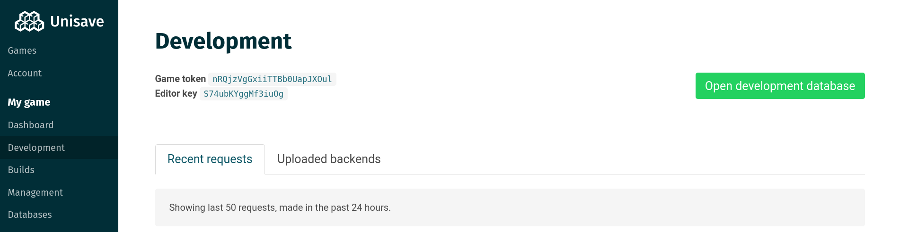
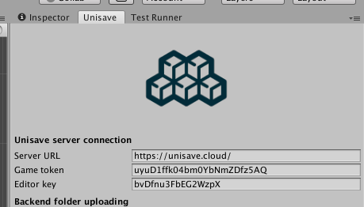

# Installation

- [Web application](#web-application)
- [Unity asset setup](#unity-asset-setup)
- [Creating backend folder](#creating-backend-folder)
- [Updating the asset](#updating-the-asset)
- [Troubleshooting](#troubleshooting)

## Web application

Before you start working in Unity, you first need an account at [unisave.cloud](https://unisave.cloud/).

- Go to [https://unisave.cloud/](https://unisave.cloud/)
- Click `Sign Up` and fill out the form
- Wait for a verification email, this may take a while
- Go to the app [https://unisave.cloud/app](https://unisave.cloud/app)
- Click `Create new game` and provide a name

Keep this page open in the browser, since you will need it later on. Now you can open up your Unity project.

## Unity asset setup

Inside Unity with your project open, you need to install the free Unisave asset from the asset store:

- Open your game project in Unity
- Open the asset store window by going to menu `Window > Asset Store`
- Search for `Unisave` and open <a href="https://assetstore.unity.com/packages/slug/142705" target="_blank">this asset</a>.
- Click `Download`, then `Import` and import all the files

Now you need to tell the asset, how to connect to the cloud service. Specifically it needs those two values you've seen above: `Game token` and `Editor key`.

In Unity, open Unisave preferences window by clicking on menu `Window > Unisave > Preferences`. And copy-paste values from the web application:

## Creating backend folder

Finally you need a place for your server-side scripts. This is the `Backend` folder. This is where all of your Unisave related logic of your game lives.

To create the `Backend` folder, simply right click in the assets folder and choose `Create > Unisave > Backend folder`.

## Updating the asset

Unity has a bit tricky asset updating. The problem is, that it only adds and modifies files, it does not remove old files. This is a problem, since Unisave asset is full of C# code and you really want deprecated files to be removed. **Otherwise the update will probably break the asset.**

Best way to install an update is to just remove the `Unisave` folder entirely and pull the new one. You will however have to set the `Game token` again. To preserve preferences, you can delete everything except for the `Unisave/Resources` folder.

This asset updating behaviour is rather weird, but it has it's reasons, so we have to just deal with it.

## Troubleshooting

**Missing token or key**

This error message is shown when you have missing or incorrect `Game token` or `Editor key`. Open the Unisave preferences window and make sure they are present and correct.

**Missing backend folder**

This means, that your `Backend` folder is missing. The other options is that there's a wrong path to the folder set in Unisave preferences.
