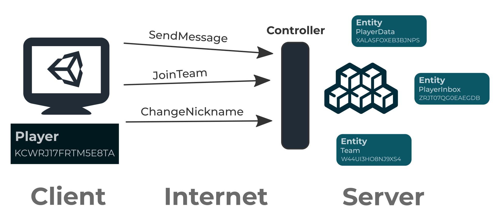
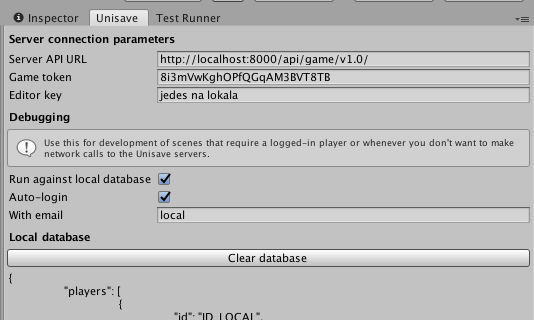

# New Cloud

- [Introduction](#introduction)
- [The database](#the-database)
- [Client & server](#client-server)
- [Local database](#local-database)


<a name="introduction"></a>
## Introduction

Unisave Cloud wastly expands the possibilities of Unisave Local and it allows you to save data in the cloud.

You don't even need to register, because the server-side is not yet implemented. You can however try it locally, just look at the examples inside the asset and read the description below.


<a name="the-database"></a>
## The database

*The database* is a space, where two kinds of objects live:

- players
- entites


Players are players of your game. They can register in your game and then login and play. A player object has an `ID`, an `Email` to login with and a password.

An entity is an object that you define. You say, which fields it has and of what type they are. Each entity also has an `ID` and belongs to a set of players.

Some entities may have special constraints on which players they can belong to. For example a `PlayerSingleton` is an entity, that a player always has exatly once, you don't even need to create it.

To create an entity, you just define it as a class inheriting from the entity type you like:

```cs
using Unisave.Framework;

public class PlayerInbox : PlayerSingleton
{
    public List<string> Messages { get; set; }
        = new List<string>();
    
    public List<string> BlockedPlayerIDs { get; set; }
        = new List<string>();

    public bool NotifyOnMessageArrival { get; set; }
        = true;
}
```


<a name="client-server"></a>
## Client & server

When building a multiplayer game, you have to prevent cheating. Because cheating damages gameplay experience of players who play fair, players that possibly pay you for that experience. This means you cannot trust your client, because it might get hacked, reverse engineered or modified in some manner. Only the server knows, what's corrent and so all data manipulation has to happen on the server.

The client is allowed only two things:

- view some data (entities) and display that data to the player
- call some actions on the server, that will actually modify the data

Server on the other hand can do almost anything.



First the client needs to download data to display:

```cs
using Unisave;

public class MyInboxBehaviour : MonoBehaviour
{
    PlayerInbox inbox;

    void Awake()
    {
        RequestEntity
            .OfPlayer(UnisaveCloud.Player)
            .Request<PlayerInbox>(inbox => {
                this.inbox = inbox;
                Debug.Log(inbox.Messages[0]);
            });
    }
}
```

When the player writes a message to another player, you can send the message:

```cs
// inside some MonoBehaviour

public void SendMessage(string content, string targetPlayerId)
{
    ControllerAction
        .On<MessagingController>()
        .SendMessage(content, targetPlayerId);
}
```

And lastly the server controller needs to handle the request:

```cs
using Unisave.Framework;

public class MessagingController : Controller
{
    [Action]
    public void SendMessage(string content, string targetPlayerId)
    {
        var inbox = GetEntity
            .OfPlayer(targetPlayerId)
            .Get<PlayerInbox>();

        inbox.Messages.Add(content);

        inbox.Save();
    }
}
```

All of this code is inside your unity project. Unisave will pick the server code files and upload them to the server (once implemented), so you don't have to worry about deployment.


<a name="local-database"></a>
## Local database

These actions require a player to be logged in. Player login and registration is the same as in the old unisave cloud, so just look at the [documentation page](unisave-cloud#registration-and-login).

The easiest way to test Unisave Cloud is however running it against the local database. In this mode, unisave simulates the client-server communication, but locally. The code and the ways it behaves stays the same.

To allow this feature, just open the Unisave configuration panel inside unity by going to `Window > Unsiave`. Here you check `Run against local database` and `Auto-login`.



This will make sure you are always logged-in as a player with email `local`. In local mode, any password will be accepted. This local player is always present inside the local database.
