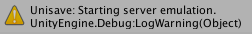
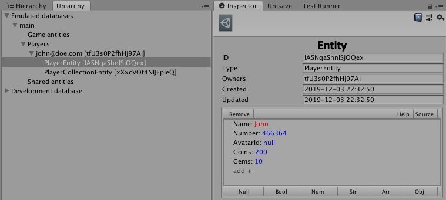
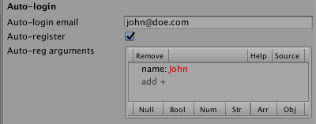

# Workflow

- [Backend folder](#backend-folder)
- [Backend uploading](#backend-uploading)
- [Auto-login and emulation](#autologin-and-emulation)
- [Run against the real server](#run-against-the-real-server)

## Backend folder

*Facets* and *entities* are objects that primarily live on the server. The backend is prepresented by a folder called `Backend` located right inside the assets folder.

Any code you put into this folder will be available on the server and so can be used inside *facets* or *entities*.

> **Tip:** To quickly create the `Backend` folder, simply right-click the assets folder and choose `Create > Unisave > Backend folder`.

## Backend uploading

The `Backend` folder is located inside your Unity project. How does it get to the server?

This is handled by backend uploading. Each time you modify contents of the folder, it will be detected and the new content will be sent to Unisave cloud. This way the server always has the latest version of code to run.

> **Tip:** Automatic uploading can be disabled in Unisave preferences, which is handy when you lack internet connection for example.

## Auto-login and emulation

Say you have our home scene from [the introduction](introduction#calling-server-methods) and you hit the *play button*. What happens?

Unity loads the scene, runs the `Start` method and then a *facet call* is performed. However a *facet* has to always be called on behalf of some player. Someone has to be logged in. But noone is.

Unisave detects this and does two things:

First it starts server emulation.

This is because it thinks we are developing the game and we don't actually want it to communicate with the real server. Emulation runs all the backend logic locally, against an in-memory database that you can easily inspect. That makes debugging much easier.

Emulated database can be viewed through *uniarchy* (Unisave hierarchy), just open `Window > Unisave > Uniarchy`:

Second thing that happens is that a player will be automatically logged in.

This is precisely because we need a player logged in in order for *facet calls* to even work. The player for auto-login can be specified in Unisave preferences:

This player will even be automatically registered, if not present in the database.

## Run against the real server

When you develop significant part of your game and you test against the emulated databse, you can try to run against the real one.

You however need a login scene present. You can use the login form prefab to get started quickly. This is explained in detail in the [authentication section](authentication).

Then you simply run Unity on your login scene and everything will work just like it did against the emulated server. Only now you can see the entities in the [web application](https://unisave.cloud/app).
